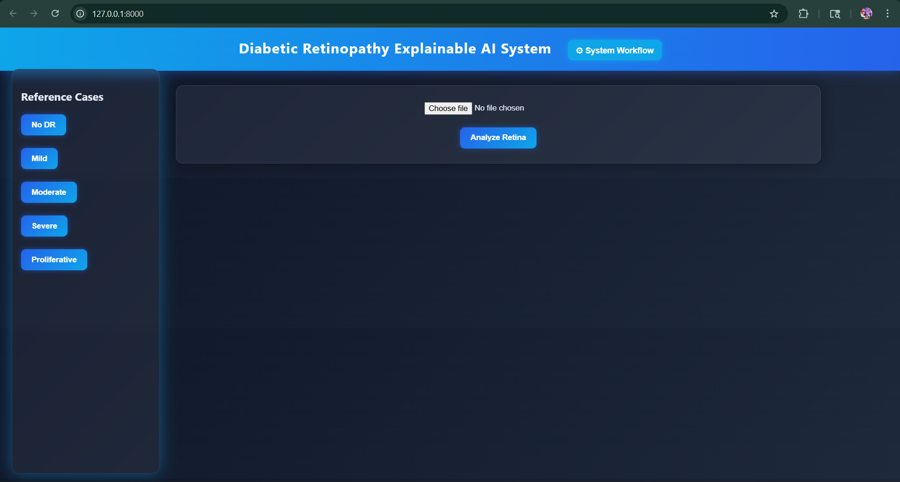

🧠 DR Explainable AI System
AI-Powered Early Detection of Diabetic Retinopathy with Explainable Visualization

An end-to-end Explainable AI platform for detecting Diabetic Retinopathy (DR) from retinal fundus images using EfficientNet-B3 and multiple visual interpretation modules designed to improve transparency and clinical trust.

The system provides:

automated DR severity prediction

explainable visual maps

retinal quality analysis

clinical-style reporting

secure report delivery

📌 Problem Statement

Diabetic Retinopathy is one of the leading causes of blindness worldwide. Early detection is crucial but often limited due to the shortage of ophthalmologists and screening infrastructure.

AI models can assist in screening, but black-box predictions reduce trust in medical settings.

This project addresses this issue by combining deep learning diagnosis with multiple explainability modules to make predictions interpretable.

🎯 Objectives

Detect DR severity from retinal images

Provide interpretable explanations for AI predictions

Visualize pathological features influencing the decision

Assist clinicians with AI-generated diagnostic reports

Improve transparency in AI-assisted screening systems

🏗 System Architecture
Retinal Image
     ↓
Preprocessing
     ↓
EfficientNet-B3 Model
     ↓
Severity Prediction
     ↓
Explainability Modules
     ↓
Visualization Dashboard
     ↓
PDF Clinical Report
     ↓
Secure Email Delivery
🤖 AI Model

Model used:

EfficientNet-B3

Trained on:

APTOS
EyePACS
Messidor
Unified DR dataset

Classification classes:

Class	Description
0	No DR
1	Mild
2	Moderate
3	Severe
4	Proliferative DR
🔍 Explainable AI Modules

The system includes multiple visualization layers to explain the AI decision.

1️⃣ Grad-CAM Heatmap

Highlights regions influencing the AI prediction.

Color Guide:

Red → strong attention
Yellow → moderate attention
Blue → low attention
2️⃣ Layered Retinal Evidence Map

Combines attention maps with lesion markers.

Overlay markers:

Red → hemorrhages
Yellow → exudates
Blue → microaneurysms
3️⃣ Focus Consistency Visualization

Measures agreement between model attention and detected lesions.

Indicators:

✔ High agreement
⚠ Partial agreement
4️⃣ Region-Wise Retina Importance Map

Shows which retinal zones influenced the decision.

Zones analyzed:

Macula
Optic disc region
Peripheral retina
5️⃣ Saliency Behavior Map

Shows how concentrated the model's attention is around lesions.

Behavior types:

Focused Attention
Moderate Spread
Diffuse Attention
6️⃣ Retinal Quality Overlay

Highlights image quality issues that may affect diagnosis.

Visualization:

Gray → blurred regions
Yellow → glare / overexposure
7️⃣ Pseudo-3D Retinal Abstraction

Layered visualization combining:

retina
vessels
lesions
AI attention
📊 Severity Progress Visualization

Displays model confidence across DR severity levels.

Example:

No DR ─ Mild ─ ███ Moderate ─ Severe ─ Proliferative
🖥 Web Interface

The system provides a dashboard for clinicians with:

retinal image upload

real-time AI analysis

explainable visualization panels

severity confidence indicators

reference case comparison

downloadable reports

📄 Clinical Report Generation

The system automatically generates a PDF diagnostic report containing:

uploaded retinal image

AI prediction

visual explanation maps

timestamp

clinical disclaimer

🔐 Secure Report Delivery

Reports can be sent via email with:

password protected PDF
6 digit security code

This simulates a clinical deployment environment.

📁 Project Structure
DR-Explainable-AI-System
│
├── app
│   ├── backend
│   │   └── main.py
│   │
│   ├── frontend
│   │   └── index.html
│   │
│   └── uploads
│
├── src
│   ├── explainability
│   ├── visualization
│   ├── inference
│   ├── reporting
│   └── email_service
│
├── models
│
├── data
│   └── reference_images
│
├── outputs
│   ├── heatmaps
│   ├── evidence_maps
│   ├── saliency_evolution
│   ├── quality_overlay
│   └── report
│
└── README.md
⚙ Installation

Clone the repository:

git clone https://github.com/kalavalashivaharikowshik/DR-Explainable-AI-System.git
cd DR-Explainable-AI-System

Install dependencies:

pip install -r requirements.txt

Run the server:

uvicorn app.backend.main:app --reload

Open in browser:

http://127.0.0.1:8000
🚀 Running on GPU (Google Colab Demo)

Open Google Colab

Clone repository

Install dependencies

Run FastAPI server

Create public link using ngrok

This allows the system to run on GPU hardware for inference.

📷 Output Examples

Create a folder inside the repository:

docs/images

Place screenshots such as:

docs/images/dashboard.png
docs/images/gradcam.png
docs/images/evidence_map.png
docs/images/saliency.png
docs/images/report.png

Then display them in README like this:

## System Dashboard

## GradCAM Heatmap

## Evidence Map

📈 Expected Outcomes

The system provides:

DR severity classification

interpretable visual explanations

improved trust in AI diagnosis

clinical-style diagnostic reports

🧪 Research Contribution

This project introduces a multi-layer explainable AI framework for diabetic retinopathy detection combining:

attention visualization

lesion-aware explanation

spatial importance analysis

model attention validation

clinical report generation

👨‍💻 Author

Kowshik
AI / Computer Vision Research Project

📜 License

This project is intended for research and educational purposes.

⚠ Disclaimer

This system provides AI-assisted decision support and should not replace professional medical diagnosis.
